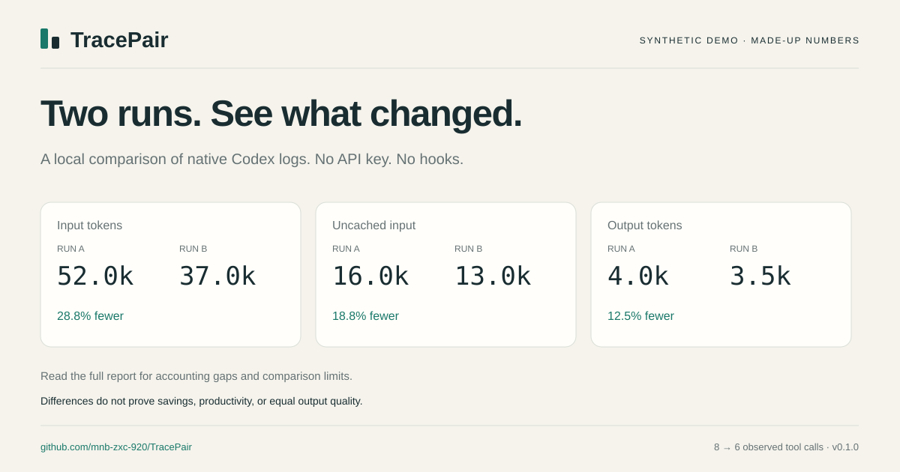

# TracePair

**See what changed between two Codex runs. Locally.**

Compare two existing Codex JSONL logs. Get an HTML report, a JSON summary, and an SVG share card — without an API key, hooks, a server, or runtime dependencies.

[View the synthetic demo](https://mnb-zxc-920.github.io/TracePair/) · [中文说明](docs/README.zh-CN.md) · [Accounting & limitations](docs/accounting.md) · [Privacy](docs/privacy.md) · [Report a problem](https://github.com/mnb-zxc-920/TracePair/issues)



*The preview uses made-up data to demonstrate the interface. It is not a measured performance improvement.*

## Try it in a minute

Requires **Python 3.10+**. From a source checkout:

```sh
git clone https://github.com/mnb-zxc-920/TracePair.git
cd TracePair
python tracepair.py demo --out my-demo
```

Open `my-demo/report.html` in your browser. Everything needed by that report is inside the file. On systems where Python is named `python3`, use that command instead.

Without Git, download `tracepair-v0.1.0-source.zip` from the [release](https://github.com/mnb-zxc-920/TracePair/releases/tag/v0.1.0), extract it, open a terminal in the extracted `TracePair-0.1.0` folder, and run the same `python tracepair.py demo --out my-demo` command. [Step-by-step first use](docs/getting-started.md) · [中文上手](docs/getting-started.zh-CN.md).

To compare your own logs:

```sh
python tracepair.py compare /path/to/run-a.jsonl /path/to/run-b.jsonl --out my-comparison
```

On Windows, quote paths that contain spaces:

```powershell
python tracepair.py compare "C:\my logs\run-a.jsonl" "C:\my logs\run-b.jsonl" --out my-comparison
```

Choose two explicit Codex rollout files from your own machine. TracePair does not scan your session directory or upload logs. Use a new output directory each time; existing directories are never replaced. For a stable report, use logs that are no longer being written.

**Where are the logs?** Codex's default session directory is `~/.codex/sessions`; archived sessions are in `~/.codex/archived_sessions`. If you set `CODEX_HOME`, use its `sessions` or `archived_sessions` subfolder instead. These locations are documented in [OpenAI's troubleshooting guide](https://learn.chatgpt.com/docs/reference/troubleshooting#feedback-and-logs). Select the two session `.jsonl` files you intend to compare; `history.jsonl` is not the per-session rollout input expected here. The [first-use guide](docs/getting-started.md#choose-your-two-logs) explains Windows paths, other environments, and missing-data messages.

## What you get

| File | Purpose |
| --- | --- |
| `report.html` | Token breakdown, tool categories, recorded span, and accounting notes |
| `summary.json` | The same aggregate comparison for your own scripts |
| `share.svg` | A compact card with fixed A/B labels and the main differences |

The reports distinguish input, cached input, uncached input, output, and reasoning output. Cached input is already part of input; reasoning is already part of output. Neither gets added twice.

Use TracePair after changing a prompt, `AGENTS.md`, or your workflow to **inspect what happened**. It does not determine whether the two tasks were equally difficult or the second answer was any good. Lower token counts alone are not success.

## Compare windows in longer sessions

```sh
python tracepair.py compare first.jsonl second.jsonl --a-start 2026-01-01T09:00:00Z --a-end 2026-01-01T10:00:00Z --b-start 2026-01-02T09:00:00Z --b-end 2026-01-02T10:00:00Z --out window-comparison
```

Starts are inclusive and ends are exclusive. A preceding cumulative snapshot supplies the baseline. Usage is attributed by snapshot timestamps, so a boundary can be approximate. A missing baseline is clearly flagged. See the [accounting rules](docs/accounting.md) before treating a window as a complete run.

## A small tool, with explicit limits

- **Codex native JSONL only** in this first release. It does not import Claude, Cursor, or arbitrary trace schemas.
- Counts recorded function/custom-tool calls. Calls nested inside an orchestration wrapper are not expanded.
- Repeated cumulative snapshots do not add usage. Counter resets and invalid required fields withhold token totals.
- Missing data remains `Unknown`. A missing field is not a measured zero.
- Recorded span includes idle time. Model-set matching does not establish a controlled experiment.
- No dollar estimates, account quota estimates, “waste scores,” automatic success grades, or causal savings claims.
- No telemetry or background services. The input logs are read; exports deliberately omit raw text, paths, session IDs, model names, and custom tool names. **Aggregate data can still be sensitive. Review it before sharing.**

The local log format can change. This is an early release, not an official OpenAI product or a billing authority. If something looks wrong, report the version, warning code and a **synthetic** reproducer. Please do not attach your original session log.

## Existing tools

[CodeBurn](https://github.com/getagentseal/codeburn) and [AgentsView](https://github.com/kenn-io/agentsview) offer broader usage/session views. [agent-strace](https://github.com/Siddhant-K-code/agent-trace) includes agent tracing and run comparisons. [agent-run-diff](https://pypi.org/project/agent-run-diff/0.1.0/) compares a general trace format. TracePair focuses on explicitly selected, already-existing Codex logs and a small offline report. It does not claim to have invented run comparison.

## Develop

```sh
python -m unittest discover -s tests -v
python tracepair.py demo --out development-demo
```

Optional installation from a checkout: `python -m pip install .` (build tooling may be installed by pip; the application has no runtime dependencies). Then use `tracepair demo`. A package registry release is not required for the commands above.

Small fixes, synthetic examples of format changes, and feedback on confusing report fields are welcome. This project is developed with AI assistance, including Codex and Grok; tests and review remain necessary, and passing checks do not prove the absence of defects.

[MIT license](LICENSE).
